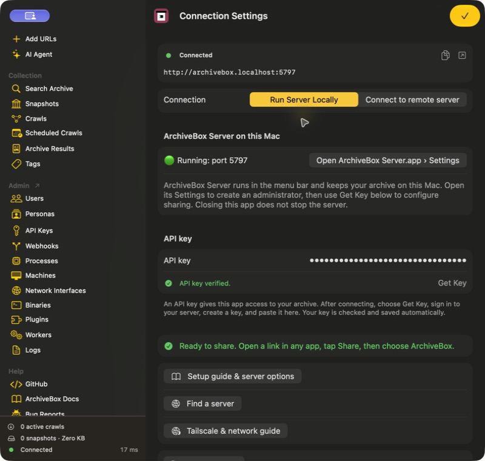
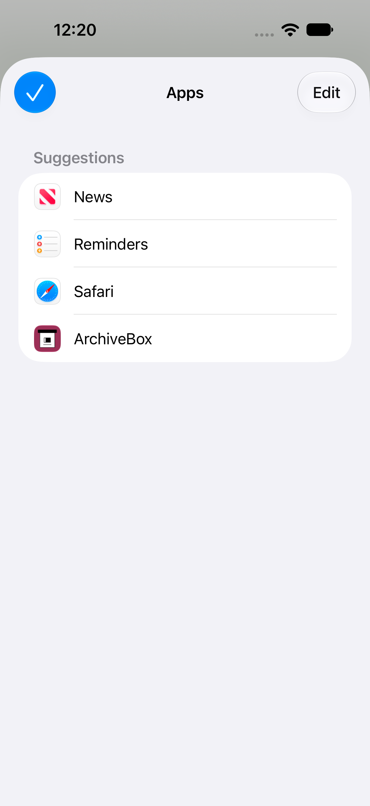

<div align="center" class="hero">

<p class="eyebrow">YOUR WEB, PRESERVED.</p>
<h1>ArchiveBox.app</h1>
<p class="hero-description">Save the web you want to keep.<br>At home on iPhone, iPad, and Mac.</p>
<p class="actions">
<a class="button primary" href="https://testflight.apple.com/join/wUG6DS6z">Join the TestFlight beta ↗</a>
&nbsp;
<a class="button secondary" href="https://github.com/ArchiveBox/ios-archivebox/releases">Mac downloads ↗</a>
</p>
<p class="platforms">iOS 26+ · iPadOS 26+ · macOS 26+ · Free &amp; open source</p>
<p class="hero-links"><a href="#get-started">Get started</a> &nbsp; · &nbsp; <a href="#your-server-your-choice">Run a server on your Mac</a> &nbsp; · &nbsp; <a href="https://github.com/ArchiveBox/ios-archivebox/issues">Feedback</a></p>
</div>

<p class="hero-screenshot" align="center"></p>

**[ArchiveBox](https://github.com/ArchiveBox/ArchiveBox) saves copies of websites so you can revisit them after they change or disappear.** ArchiveBox.app brings your archive to your Apple devices. Share a link, browse saved pages, and manage your collection from one native app.

- 📥 **Save from other apps** with the iPhone, iPad, and Mac share sheet.
- 🏛️ **Browse your archive** with snapshots, search, tags, and saved output formats.
- 🧭 **Collect from Safari** with the included browser extension.
- 👤 **Choose a persona** to use the right server-side cookies for shared links.
- 🔑 **Connect to your own server** with a URL and API key.

## Get started

1. **Install ArchiveBox.app.** [Join TestFlight](https://testflight.apple.com/join/wUG6DS6z) on iPhone, iPad, or Mac, or find the Mac app on [GitHub Releases](https://github.com/ArchiveBox/ios-archivebox/releases).
2. **Connect your archive.** Open **Connection Settings** and enter your server URL. On Mac, you can also choose **Run Server Locally** to use the optional companion below.
3. **Add your API key.** Click **Get Key**, sign in to your server, and create an administrator API key. Paste it into the app; the connection is checked automatically.
4. **Save your first link.** In any app that shares URLs, choose **Share → ArchiveBox**. The link is sent immediately; optionally add tags, then tap **Done** after confirmation.

<p class="caption">Beta software. TestFlight builds depend on Apple’s review; Mac downloads appear on the releases page as they are published. Connect to ArchiveBox 0.9.x or later. Mac downloads require Apple Silicon.</p>

<p class="screenshot" align="center"></p>

<div class="feature" markdown="1">

## Share it. Keep it.

<p class="phone-screenshot" align="right"></p>

- Open a link in Safari, Mail, Messages, or another app.
- Tap the **Share** button and choose **ArchiveBox**.
- The link is sent immediately. Add tags while the sheet stays open, then tap **Done** after the server confirms.
- Find the result in **Snapshots** after the server finishes archiving.

Set **Default Persona** under **Add URLs → Share Sheet** to choose the server profile used for shared links. Personas can carry the cookies needed to archive pages that require a login.

**Your server must be reachable when you share.** The app sends links directly; offline queueing is not supported. A success message means the server accepted the URL.

Tags are saved separately through the REST API, without submitting the URL again. Pick suggested tags from your server or use commas to add several new tags; tap a tag’s × to remove it. **Done** also saves any text still in the tag field. If a tag update fails, the sheet keeps the successful link submission and offers **Retry tags**. **Remove** cancels and deletes this share’s crawl after confirmation; previous captures of the same URL are kept.

<details markdown="1">
<summary>Can’t see ArchiveBox in the share sheet?</summary>

- **iPhone / iPad:** open the share sheet’s app row, choose **More**, then **Edit** to add ArchiveBox to your favorites.
- **Mac:** enable ArchiveBox in **System Settings → General → Login Items & Extensions → Extensions → Sharing**.

</details>

</div>

## Your server, your choice

Use an existing ArchiveBox server anywhere you can reach it, or keep your archive on your Mac with **ArchiveBox Server.app**.

| | ArchiveBox.app | ArchiveBox Server.app |
|---|---|---|
| **What it does** | Save links, browse, and manage your archive | Run the actual ArchiveBox server on your Mac |
| **Where it runs** | iPhone, iPad, and Mac | Apple Silicon Mac with macOS 26+ |
| **What to install** | The client on each device you use | The optional companion on the Mac that stores your archive |
| **Already have a server?** | Connect it in Settings | You don’t need the companion |

### ArchiveBox Server.app

**A home for your archive, right on your Mac.** The optional companion runs quietly in the menu bar and keeps archiving when you close the client app.

- 🟢 **See what’s running:** server status, active downloads, CPU, and memory.
- 🗂️ **Choose where your archive lives** and open its files in Finder.
- 👥 **Create an administrator** and manage users from Settings.
- ⏯️ **Pause and resume archiving** from the menu bar.
- 🖥️ **Open the archive, watch activity, or use the built-in terminal.**

1. On Mac, open **ArchiveBox.app → Connection Settings → Run Server Locally**.
2. Download and open **ArchiveBox Server.app**, then create your first administrator in its Settings.
3. Return to the client and use **Get Key** to finish connecting.

The companion is a separate download, installed only when you choose to run locally. The main app stays small. Your archive stays on disk when you quit either app.

<details markdown="1">
<summary>Connect from your iPhone, iPad, or another Mac</summary>

- Use a server address reachable from that device, over your network or VPN.
- `localhost` on an iPhone means the iPhone itself, not your Mac.
- The Mac companion starts with a local-only listener. Remote access needs a separately configured proxy or tunnel; see [ArchiveBox networking and setup](https://github.com/ArchiveBox/ArchiveBox/wiki/Configuration).
- The Mac running your server must be awake and reachable to receive new links.

</details>

## Save from your browser, too

**The Safari extension is included with ArchiveBox.app.** Enable it in Safari’s Extensions settings, then save pages from the toolbar.

- Save individual pages or import URLs from bookmarks where supported.
- Use the app’s server connection automatically, or configure the extension separately.
- Choose a browser persona and sync cookies for pages that need a login.
- Keep the browser’s persona separate from the share sheet’s Default Persona.

<p class="browser-links"><a href="https://github.com/ArchiveBox/archivebox-browser-extension">Safari setup &amp; extension guide ↗</a> &nbsp; · &nbsp; <a href="https://chrome.google.com/webstore/detail/habonpimjphpdnmcfkaockjnffodikoj">Chrome / Brave</a> &nbsp; · &nbsp; <a href="https://addons.mozilla.org/firefox/addon/archivebox-exporter/">Firefox</a> &nbsp; · &nbsp; <a href="https://microsoftedge.microsoft.com/addons/detail/archivebox/dmlljpjhnfjgchbkcgheebcffocgooeh">Edge</a></p>

## Help & feedback

- 📖 [ArchiveBox documentation](https://github.com/ArchiveBox/ArchiveBox/wiki) — setup, archiving, and managing your collection.
- 💬 [Community forum](https://zulip.archivebox.io) — ask questions and share what you’re building.
- 🐛 [Report an app bug](https://github.com/ArchiveBox/ios-archivebox/issues) — include your device, OS version, and what happened.

<details id="privacy-and-license" markdown="1">
<summary><strong>Privacy &amp; license</strong></summary>

### Privacy

- The native apps contain no analytics or tracking SDKs and require no developer-operated cloud account.
- Shared URLs are sent to the ArchiveBox server you configure. That server’s administrator controls storage, access, and retention.
- The app stores connection credentials in device-only Keychain. Shared URLs stay in memory during submission; the native share sheet keeps no local history or offline queue.
- Embedded server pages use a browser session in memory. Your server and the pages you open may have their own privacy policies.
- The Safari extension has its own local storage and optional cookie syncing. Review its [settings and documentation](https://github.com/ArchiveBox/archivebox-browser-extension) before enabling those features.
- The server contacts websites you ask it to archive and any external services enabled in its configuration. Review [ArchiveBox privacy and security settings](https://github.com/ArchiveBox/ArchiveBox/wiki/Security-Overview), including submission to Archive.org.
- Downloads, updates, and TestFlight use GitHub’s and Apple’s services and are subject to their policies.
- For privacy questions, use the [ArchiveBox contact information](https://archivebox.io) or [community forum](https://zulip.archivebox.io). Don’t include passwords or API keys in public reports.

### License

Free and open source under the [MIT license](https://github.com/ArchiveBox/ios-archivebox/blob/main/LICENSE). See [branding credits](https://github.com/ArchiveBox/ios-archivebox/blob/main/docs/BRANDING.md), [browser icon credits](https://github.com/ArchiveBox/ios-archivebox/blob/main/App/Assets.xcassets/Browser-Icons-LICENSE.txt), and the [bundled extension license](https://github.com/ArchiveBox/ios-archivebox/blob/main/SafariWebExtension/UPSTREAM-LICENSE). The companion’s bundled components retain their upstream licenses.

</details>

<details id="development" markdown="1">
<summary><strong>Build from source &amp; contribute</strong></summary>

Requires Xcode 26+, Node.js 22+, and pnpm 10.33.2. See the [developer guide](https://github.com/ArchiveBox/ios-archivebox/blob/main/docs/DEVELOPMENT.md) for signing, platform targets, and verification.

```sh
git clone https://github.com/ArchiveBox/ios-archivebox.git
cd ios-archivebox
node scripts/prepare-safari.mjs
swift test
open ArchiveBox.xcodeproj
```

- Select **ArchiveBox** for iPhone/iPad or **ArchiveBoxMac** for Mac, then choose your development team.
- Build the optional companion with `bash ServerApp/prepare.sh` followed by `bash ServerApp/build.sh` (large downloads). See the [server build guide](https://github.com/ArchiveBox/ios-archivebox/blob/main/ServerApp/README.md).
- [Release instructions](https://github.com/ArchiveBox/ios-archivebox/blob/main/docs/RELEASES.md) · [TestFlight setup](https://github.com/ArchiveBox/ios-archivebox/blob/main/docs/TESTFLIGHT.md) · [Validation notes](https://github.com/ArchiveBox/ios-archivebox/blob/main/docs/VALIDATION.md) · [Website editing](https://github.com/ArchiveBox/ios-archivebox/blob/main/docs/site/README.md)
- Please [open an issue](https://github.com/ArchiveBox/ios-archivebox/issues) to discuss substantial changes before starting a PR.

</details>

---

## More from ArchiveBox

- [**ArchiveBox**](https://github.com/ArchiveBox/ArchiveBox) — the self-hosted server, web UI, and CLI.
- [**Browser Extension**](https://github.com/ArchiveBox/archivebox-browser-extension) — collect URLs and browser captures in Safari, Chrome, Brave, Firefox, and Edge.
- [**abx-dl**](https://github.com/ArchiveBox/abx-dl) — standalone command-line web archiving.
- [**abx-plugins**](https://github.com/ArchiveBox/abx-plugins) — archiving plugins and output formats.
- [**abxpkg**](https://github.com/ArchiveBox/abxpkg) — install and manage archiving tools.

<p align="center" class="closing"><a href="https://archivebox.io">ArchiveBox.io</a> &nbsp; · &nbsp; <a href="https://github.com/ArchiveBox">GitHub</a> &nbsp; · &nbsp; <a href="https://github.com/sponsors/pirate">Support the project ♡</a><br><sub>Your data. Your devices. Your archive.</sub></p>
