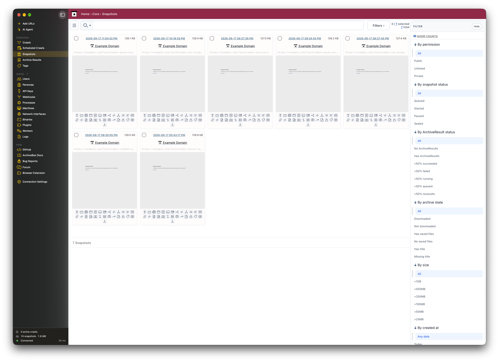
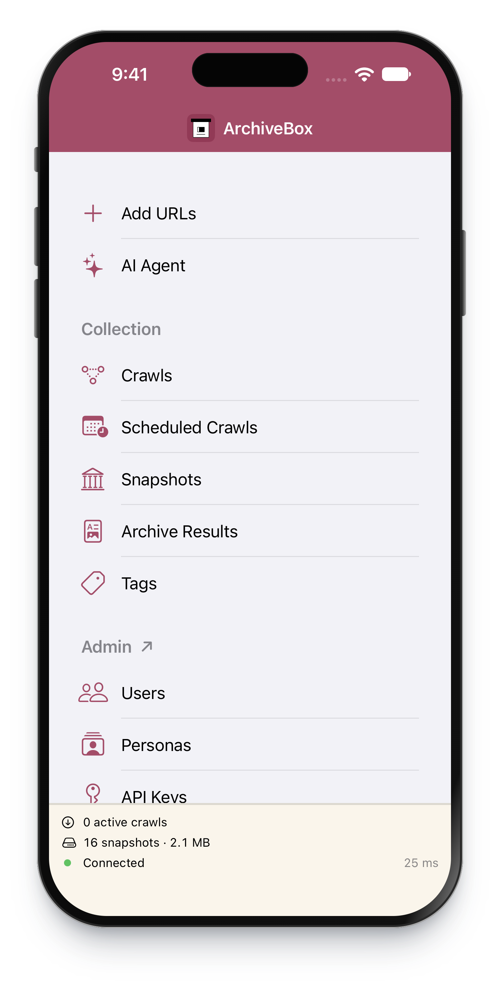

<div align="center" class="hero" data-platform-group>

<p class="eyebrow">YOUR WEB, PRESERVED.</p>
<h1>ArchiveBox.app</h1>
<p class="hero-description">Save the web you want to keep.<br>At home on iPhone, iPad, and Mac.</p>
<p class="actions">
<a class="button primary is-platform-match" data-platform="ios" data-platform-default href="https://testflight.apple.com/join/wUG6DS6z"> ArchiveBox for iOS </a>
<a class="button secondary" data-platform="macos" href="https://github.com/ArchiveBox/ios-archivebox/releases/latest/download/ArchiveBox.app.zip"> ArchiveBox for macOS </a>
<a class="button secondary" href="https://github.com/ArchiveBox/ios-archivebox/releases/latest/download/ArchiveBox.Server.app.zip"> ArchiveBox Server for macOS </a>
</p>
<p class="actions other-platforms" aria-label="ArchiveBox for other platforms">
<a class="button platform" data-platform="android" href="https://android.archivebox.io/"> Android </a>
<a class="button platform" data-platform="windows" href="https://windows.archivebox.io/"> Windows </a>
<a class="button platform" data-platform="linux" href="https://linux.archivebox.io/"> Linux </a>
<a class="button platform" href="https://archivebox.io/#install-compose"> Docker </a>
</p>
<p class="platforms">iOS 26+ · iPadOS 26+ · macOS 26+ · Free &amp; open source</p>
<p class="hero-links"><a href="#get-started">Get started</a> &nbsp; · &nbsp; <a href="#your-server-your-choice">Run a server on your Mac</a> &nbsp; · &nbsp; <a href="https://github.com/ArchiveBox/ios-archivebox/issues">Feedback</a></p>
</div>

<p class="hero-screenshot" align="center"></p>

**[ArchiveBox](https://github.com/ArchiveBox/ArchiveBox) saves copies of websites so you can revisit them after they change or disappear.** ArchiveBox.app brings your archive to your Apple devices. Share a link, browse saved pages, and manage your collection from one native app.

- 📥 **Save from other apps** with the iPhone, iPad, and Mac share sheet.
- 🏛️ **Browse your archive** with snapshots, search, tags, and saved output formats.
- 🧭 **Collect from Safari, Chrome, Firefox, Brave, and other browsers** using the included browser extension.
- 👤 **Save pages that require a login** using personas.
- 🔑 **Connect to your own server** with a URL and API key.

## Get started

1. **Install ArchiveBox.app.** [Join TestFlight](https://testflight.apple.com/join/wUG6DS6z) on iPhone, iPad, or Mac, or find the Mac app on [GitHub Releases](https://github.com/ArchiveBox/ios-archivebox/releases).
2. **Choose a home for your archive.** The first-run guide explains how saving works and helps you choose the Mac server app, paid hosting, Docker, or a Python installation. Already set up? Choose **I already have a server** to go straight to **Connection Settings**. On Mac, **Set up on this Mac** opens **Run Server Locally**.
3. **Sign in.** Scan the connection QR in the Mac server's **Network access** settings with your iPhone Camera to fill the address and administrator key automatically. For another server, use **Get Key** to create a key, then paste it into the app.
4. **Save your first link.** Choose **Share → ArchiveBox** from any app that shares URLs.

<p class="caption">Beta · Requires ArchiveBox 0.9.x or later · Mac downloads require Apple Silicon.</p>

<div class="device-pair" align="center">
<a href="docs/screenshots/home-iphone.png"></a>
</div>

<div class="feature" markdown="1">

## Share it. Keep it.


- Open a link in Safari, Chrome, Firefox, Brave, Mail, Messages, or another app.
- Tap the **Share** button and choose **ArchiveBox**.
- Add tags to keep your collection organized.
- Find the result in **Snapshots** after the server finishes archiving.

Choose a **Default Persona** in **Add URLs** for pages that require a login.

Your server must be reachable to save new links.

<details markdown="1">
<summary>Can’t see ArchiveBox in the share sheet?</summary>

- **iPhone / iPad:** open the share sheet’s app row, choose **More**, then **Edit** to add ArchiveBox to your favorites.
- **Mac:** enable ArchiveBox in **System Settings → General → Login Items & Extensions → Extensions → Sharing**.

</details>

</div>

## Search, Siri, and Apple system features

Choose **Search Archive** for native search by title, URL, or tag. Open a saved page, share its original or archived URL, or drag a result into another app. On Mac, press **⌘F** to open search.

- **Siri AI on iOS/iPadOS/macOS 27:** search and open actions adopt Apple's system schemas. Search opens the native results screen. Availability depends on your device's Siri language, region, and system settings.
- **Phrase shortcuts:** say **“Search ArchiveBox”** and answer the search prompt, **“Save links to ArchiveBox,”** **“Open a saved page in ArchiveBox,”** or **“Browse ArchiveBox.”** The background search action returns structured pages for use in your own shortcuts.
- **Spotlight:** pages loaded in native search or opened through app links contribute their title, URL, and tags to the device's search index. Apple’s system settings control Siri and Spotlight access. Metadata expires after seven days unless refreshed and is cleared when the saved server or API key changes.
- **Widgets and controls:** add ArchiveBox's Search/Add widget or its controls to supported system surfaces, including Control Center and the Lock Screen. They open the app without exposing credentials or submitting links automatically.
- **Handoff and onscreen context:** continue an open archived page on another Apple device connected to the same server. Native search rows and opened pages expose their identity to the system.

Connect your server first. Searching, resolving saved pages, and archiving require access to that server; the app doesn't download the entire collection for offline search. These integrations don't promise Siri can summarize every archived page's contents.

## Your server, your choice

Use an existing ArchiveBox server anywhere you can reach it, or keep your archive on your Mac with **ArchiveBox Server.app**.

| | ArchiveBox.app | ArchiveBox Server.app |
|---|---|---|
| **What it does** | Save links, browse, and manage your archive | Run the actual ArchiveBox server on your Mac |
| **Where it runs** | iPhone, iPad, and Mac | Apple Silicon Mac with macOS 26+ |
| **What to install** | The client on each device you use | The optional companion on the Mac that stores your archive |
| **Already have a server?** | Connect it in Settings | You don’t need the companion |

<div class="server-download-heading">
<h3 id="archivebox-serverapp"><a class="button server-download" href="https://github.com/ArchiveBox/ios-archivebox/releases"> <span>ArchiveBox Server.app</span> </a></h3>
<p>Share a single ArchiveBox instance across multiple users and devices.</p>
</div>

**A home for your archive, right on your Mac.** The optional companion runs quietly in the menu bar and keeps archiving when you close the client app.

- 🟢 **See what’s running:** server status, active downloads, CPU, and memory.
- 🗂️ **Choose where your archive lives** and open its files in Finder.
- 👥 **Create an administrator** and manage users from Settings.
- ⏯️ **Pause and resume archiving** from the menu bar.
- 🖥️ **Open the archive, watch activity, or use the built-in terminal.**

1. On Mac, open **ArchiveBox.app → Connection Settings → Run Server Locally**.
2. Download and open **ArchiveBox Server.app**, then create your first administrator in its Settings.
3. Return to the client and use **Get Key** to finish connecting.

Your saved archive stays on your Mac when you quit either app.

<details markdown="1">
<summary>Connect from your iPhone, iPad, or another Mac</summary>

- Use a server address reachable from that device, over your network or VPN.
- To access your Mac’s server from other devices, follow the [ArchiveBox networking guide](https://github.com/ArchiveBox/ArchiveBox/wiki/Configuration).
- The Mac running your server must be awake and reachable to receive new links.

</details>

<div class="feature" markdown="1">

## Save from your browser, too

<p class="phone-screenshot" align="right"><a href="docs/screenshots/extension-iphone.png?v=2"></a></p>

**Collect from Safari, Chrome, Firefox, Brave, and Edge with the ArchiveBox browser extension.**

- Save pages from your browser’s toolbar.
- Import bookmarks where supported.
- Save pages that require a login using browser personas.

<p class="browser-links"><a href="https://github.com/ArchiveBox/archivebox-browser-extension">Browser setup &amp; extension guide ↗</a> &nbsp; · &nbsp; <a href="https://chrome.google.com/webstore/detail/habonpimjphpdnmcfkaockjnffodikoj">Chrome / Brave</a> &nbsp; · &nbsp; <a href="https://addons.mozilla.org/firefox/addon/archivebox-exporter/">Firefox</a> &nbsp; · &nbsp; <a href="https://microsoftedge.microsoft.com/addons/detail/archivebox/dmlljpjhnfjgchbkcgheebcffocgooeh">Edge</a></p>

</div>

## Help & feedback

- 📖 [ArchiveBox documentation](https://github.com/ArchiveBox/ArchiveBox/wiki) — setup, archiving, and managing your collection.
- 💬 [Community forum](https://zulip.archivebox.io) — ask questions and share what you’re building.
- 🐛 [Report an app bug](https://github.com/ArchiveBox/ios-archivebox/issues) — include your device, OS version, and what happened.

<details id="privacy-and-license" markdown="1">
<summary><strong>Privacy &amp; license</strong></summary>

### Privacy

- The native apps contain no analytics or tracking SDKs and require no developer-operated cloud account.
- Shared URLs are sent to the ArchiveBox server you configure. That server’s administrator controls storage, access, and retention.
- The app stores connection credentials in device-only Keychain. Shared URLs stay in memory during submission; the native share sheet keeps no URL history or offline queue. It remembers the two most recently saved tag names per server on this device.
- Native search and opened-page metadata can appear in the device's Spotlight index. Handoff shares the open page's title and credential-free link with your other Apple devices. Archive contents are not publicly indexed.
- Embedded server pages use a browser session in memory. Your server and the pages you open may have their own privacy policies.
- The browser extension for Safari, Chrome, Firefox, Brave, and Edge has its own local storage and optional cookie syncing. Review its [settings and documentation](https://github.com/ArchiveBox/archivebox-browser-extension) before enabling those features.
- The server contacts websites you ask it to archive and any external services enabled in its configuration. Review [ArchiveBox privacy and security settings](https://github.com/ArchiveBox/ArchiveBox/wiki/Security-Overview), including submission to Archive.org.
- Downloads, updates, and TestFlight use GitHub’s and Apple’s services and are subject to their policies.
- For privacy questions, use the [ArchiveBox contact information](https://archivebox.io) or [community forum](https://zulip.archivebox.io). Don’t include passwords or API keys in public reports.

### License

Free and open source under the [GNU GPLv3 only (GPL-3.0-only)](https://github.com/ArchiveBox/ios-archivebox/blob/main/LICENSE). Copyright (c) 2026 ArchiveBox contributors. See [branding credits](https://github.com/ArchiveBox/ios-archivebox/blob/main/docs/BRANDING.md), [browser icon credits](https://github.com/ArchiveBox/ios-archivebox/blob/main/App/Assets.xcassets/Browser-Icons-LICENSE.txt), the [Public Suffix List license](https://github.com/ArchiveBox/ios-archivebox/blob/main/Sources/ArchiveBoxCore/Resources/public_suffix_list.dat), and the [bundled extension license](https://github.com/ArchiveBox/ios-archivebox/blob/main/SafariWebExtension/UPSTREAM-LICENSE). Website button icons are from [Font Awesome Free](https://fontawesome.com), used under [CC BY 4.0](https://github.com/ArchiveBox/ios-archivebox/blob/main/docs/icons/LICENSE.txt). The companion’s bundled components retain their upstream licenses.

</details>

<details id="development" markdown="1">
<summary><strong>Build from source &amp; contribute</strong></summary>

Requires Xcode 27+, Node.js 22+, and pnpm 10.33.2. See the [developer guide](https://github.com/ArchiveBox/ios-archivebox/blob/main/docs/DEVELOPMENT.md) for signing, platform targets, and verification.

```sh
git clone https://github.com/ArchiveBox/ios-archivebox.git
cd ios-archivebox
node scripts/prepare-safari.mjs
swift test
open ArchiveBox.xcodeproj
```

- Select **ArchiveBox** for iPhone/iPad or **ArchiveBoxMac** for Mac, then choose your development team.
- Build the optional companion with `bash ServerApp/prepare.sh` followed by `bash ServerApp/build.sh` (large downloads). See the [server build guide](https://github.com/ArchiveBox/ios-archivebox/blob/main/ServerApp/README.md).
- [Release instructions](https://github.com/ArchiveBox/ios-archivebox/blob/main/docs/RELEASES.md) · [TestFlight setup](https://github.com/ArchiveBox/ios-archivebox/blob/main/docs/TESTFLIGHT.md) · [Website editing](https://github.com/ArchiveBox/ios-archivebox/blob/main/docs/site/README.md)
- Please [open an issue](https://github.com/ArchiveBox/ios-archivebox/issues) to discuss substantial changes before starting a PR.

</details>

---

## More from ArchiveBox

- [**ArchiveBox**](https://github.com/ArchiveBox/ArchiveBox) — the self-hosted server, web UI, and CLI.
- [**Browser Extension**](https://github.com/ArchiveBox/archivebox-browser-extension) — collect URLs and browser captures in Safari, Chrome, Brave, Firefox, and Edge.
- [**abx-dl**](https://github.com/ArchiveBox/abx-dl) — standalone command-line web archiving.
- [**abx-plugins**](https://github.com/ArchiveBox/abx-plugins) — archiving plugins and output formats.
- [**abxpkg**](https://github.com/ArchiveBox/abxpkg) — install and manage archiving tools.

<p align="center" class="closing"><a href="https://archivebox.io">ArchiveBox.io</a> &nbsp; · &nbsp; <a href="https://github.com/ArchiveBox">GitHub</a> &nbsp; · &nbsp; <a href="https://github.com/sponsors/pirate">Support the project ♡</a><br><sub>Your data. Your devices. Your archive.</sub></p>
