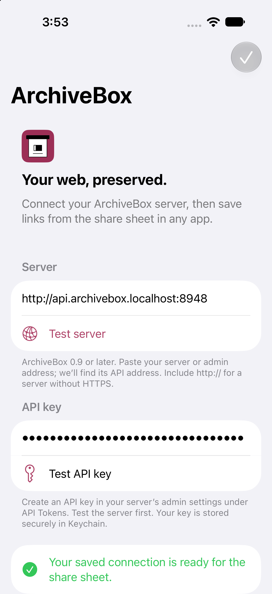
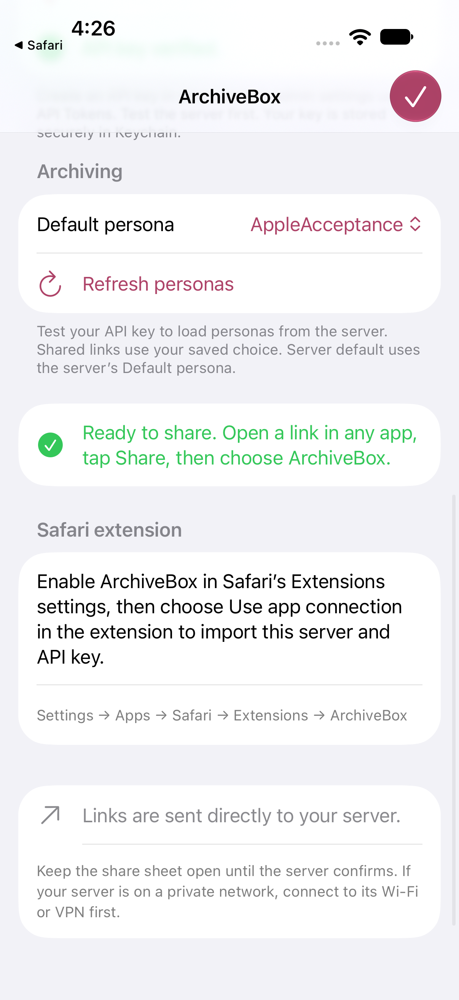
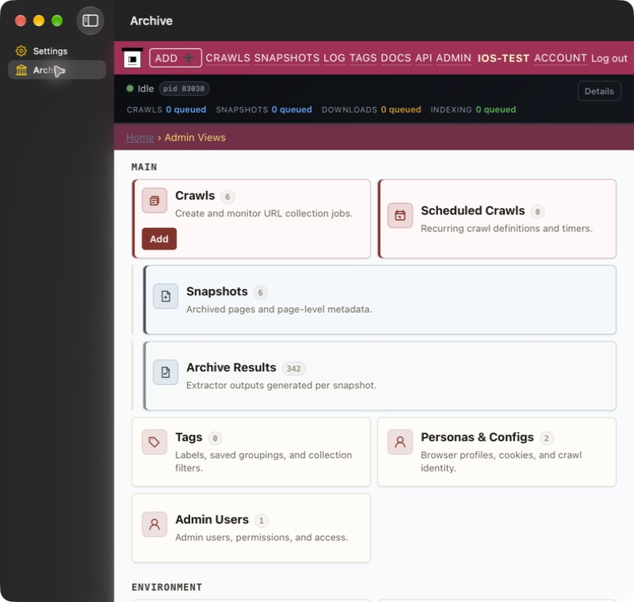
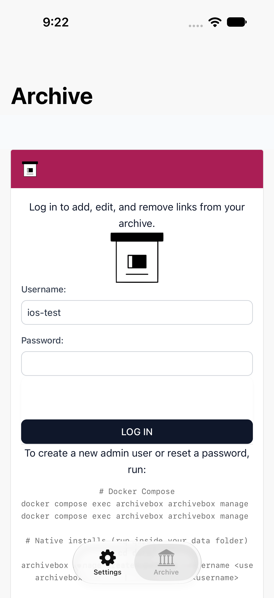

# Acceptance evidence

Validated on 2026-09-16 using Xcode 27.0, an iPhone 18 Pro simulator running iOS 27.0, and isolated real ArchiveBox 0.9.35rc446 collections. The app deployment target is iOS 26; compatibility with the Xcode 26 SDK is checked by CI.

- Swift Testing: address normalization, IPv4/IPv6, known API/admin/web host alternatives, invalid address rejection, mixed-text URL extraction, deduplication, and non-web URL rejection.
- iOS app and embedded share extension: built and installed successfully.
- Real settings UI: server probe; rejection of an invalid key; acceptance of a real key; save to shared Keychain; persistence verified after terminating/relaunching the app.
- Real Safari share sheet: opened an example.com URL, selected ArchiveBox, reviewed the URL, tapped Save to ArchiveBox, and observed server-acceptance confirmation.
- Independent server database verification: the exact shared URL appeared in `core_snapshot`, ID `01a0ac689c38713494bf31e699b679da`.
- Real subdomain server: entering the base address found `http://api.archivebox.localhost:8948`. Invalid keys were rejected; a valid key submitted a link. A separate GET of the resulting crawl confirmed its stored URL.

The API integration uncovered and now handles ArchiveBox’s asynchronous snapshot creation: a successful add can initially return an empty `snapshot_ids` array with a persisted `crawl_id` and matching `queued_urls`. The app confirms that receipt rather than waiting for extraction.

No mock servers, intercepted requests, injected settings, simulated share hosts, or production credentials were used. The UI test uses public XCTest actions on the actual app and Safari. The server was initialized with the public ArchiveBox CLI, and API credentials were obtained through its auth API.

Not yet validated: physical-device local-network permissions, distribution provisioning/TestFlight, App Store review, and sharing from every third-party app. URL and plain-text item representations are supported, but arbitrary file/media archiving is outside scope.

The full settings → Safari share UI test also passed against the subdomain-mode server, including automatic correction from the base host to the API host.

## Native Mac, Safari packaging, and personas

- Signed native macOS app, share extension, and Safari Web Extension built with Xcode 27.0. Safari recognizes the bundled extension as ArchiveBox 3.3.2.
- Manually tested Mac config UI: normalized server URL, API key validation, live persona dropdown with `AppleAcceptance` and `Default`, and shared Keychain save.
- Used Safari’s real macOS File → Share → ArchiveBox sheet. It displayed the saved server and `AppleAcceptance`, submitted the URL, and showed “Sent to ArchiveBox.” Independent SQLite verification matched the URL and persona on crawl `01a0ac80c4a5755694ce8db5ac2a59be`.
- Live Swift API integration fetched both server personas and submitted with `AppleAcceptance`. The persisted crawl `01a0ac7cec1e770e9548c409cf9a2e02` references that persona.
- Updated iPhone UI flow selected the live persona, saved/reloaded configuration, and submitted through Safari. The persisted crawl `01a0ac835e7175e38d63f7c48ceb2d1f` references `AppleAcceptance`. An unsigned test build correctly failed shared-Keychain access; runtime tests require signing entitlements. A subsequent signed run completed all UI assertions but Xcode stalled finalizing its result while repeatedly resolving the package graph; a separate build/test invocation reproduced the report-finalization wait. A sample located the wait in XCTest’s `XCTCrashLogTracker.waitForPendingCrashlogs()`.
- Upstream WXT source is pinned and built without modifying the browser-extension checkout. Both Apple bundles contain the WXT assets and native connection-import handler.

The final iPhone flow uses the fully opened Apps list rather than the underlying horizontal share carousel. All assertions completed, including the visible selected persona and success receipt; crawl `01a0ac8d0590779ab506788ea7580012` independently confirms the exact URL and `AppleAcceptance`. The Xcode 27 runner’s pending-crash-log wait prevents calling the final UI test report green, even though the user-facing flow completed. No assertions were disabled or loosened.

Safari native-message import still needs an enabled-extension runtime check: Safari ignored automated clicks on its enable checkbox. No Safari security settings were bypassed. iPad and other iPhone form factors share adaptive views/targets but were not separately run. Only the already installed iPhone simulator was used for these expanded checks.

GitHub Actions run [35162082842](https://github.com/ArchiveBox/ios-archivebox/actions/runs/35162082842) passed the pinned WXT build, five Swift tests, and builds of the iOS and macOS apps with both embedded extensions.

## Settings and Archive screens

- Signed macOS and iPhone simulator builds succeeded. The shared screen uses native SwiftUI adaptive tabs/sidebar and WebKit's SwiftUI web view, with no platform-specific web-view wrapper.
- Mac: starts in Settings; Archive cannot be selected before connection. Connecting loads the real server's admin login. Signed in as the disposable acceptance user, opened Personas, and switched Settings → Archive: the same page and authenticated session remained. Editing the server prevented selecting Archive again.
- iPhone: the focused `testArchiveRequiresConnection` test completed successfully, including launch selection, blocked Archive navigation, a real successful server probe, rendered admin login fields, keyboard input/dismissal, preserved input across tab switches, and re-locking after editing the URL. Its result bundle finalized successfully, unlike the earlier Safari share-test runner issue noted above.
- The embedded website uses its normal login and cookies; no native API key is injected. `/admin/` routing is delegated to the server, whose subdomain middleware redirects it to the configured admin host.

Only the installed iPhone simulator and native Mac were run. iPad uses the same adaptive navigation; additional runtimes were not downloaded. A URL bar and explicit back/forward buttons remain future UI work.

## Automatic Safari connection (2026-09-17)

- Removed manual connection import. The packaged WXT settings reader now asks the native Keychain handler on every read; Safari connection fields are read-only and tokens are not copied to browser storage. Missing/locked native configuration fails closed.
- Swift tests and the patched WXT TypeScript check pass. Signed macOS build and physical-device iOS Release archive succeed.
- Live Safari popup used the app's saved connection. After changing and saving it from `localhost:8947` to `api.archivebox.localhost:8947` through the native Settings UI, opening the extension on a fresh URL showed **Server Archived / Saved to ArchiveBox Server at depth 0**, without an import action or another Safari restart. Independent SQLite verification found snapshot `01a0b058919373549da1074217909cda` for `https://example.com/?archivebox-auto-connection=20260917`.
- The earlier failure combined a stopped acceptance server with a subsequent 403 on the wrong host. The running acceptance server now uses `BASE_URL=http://archivebox.localhost:8947`. Native discovery and the packaged extension's error suggestion use `api.archivebox.localhost`, not `api.localhost`.

## Optional macOS server companion (2026-09-17)

- `ServerApp` builds independently in this repo. Packaged app is approximately 1.2 GB; the direct client is approximately 7.6 MB and contains no runtime/image payload. The companion is installed locally at `~/Applications/ArchiveBox Server.app` with a development-only ad-hoc signature.
- Launched the companion using the main client's **This Mac → Run server locally** button. The main client discovered `http://api.archivebox.localhost:18080`; the real server returned its OpenAPI document with HTTP 200, version 0.9.35rc449.
- Verified the companion's embedded Archive UI and Settings resource monitor (live CPU, RAM, process count, collection size). SwiftTerm executed `pwd`, `id`, `archivebox status`, and `archivebox add https://example.com/?archivebox-server-acceptance=20260917`. Commands ran in `/data` as UID/GID 911; the resulting Example Domain snapshot was sealed with 32 successful extractor results and appeared in the embedded Archive page. SQLite `quick_check` returned `ok`.
- Closing the companion window left the API responding with HTTP 200. Quitting the companion changed its named container to `stopped`. Launching again from the main client restarted the same collection successfully. No prototype data was migrated or removed.
- Switching back to Remote server restored the earlier URL, masked API key, and selected persona. A fresh local profile had an empty API key. The existing remote profile is left selected for sharing; a local admin/API key has not been created, so native sharing to this new local collection is not yet authenticated/tested.
- Five Swift core tests, signed direct macOS build, sandboxed macOS build, and generic iOS Simulator build passed. Companion release compilation, shell syntax, and deep/strict bundle signature verification passed. Direct client entitlements were inspected: shared Keychain access, no app sandbox. CI now compiles both macOS configurations and the companion without downloading its large build assets.
- Fixed issues observed during live checks: explicit HTTP transport allowance for `*.localhost`, repeat kernel registration using `--force`, and XcodeGen's generated entitlements overriding the direct build's selected entitlements file.
- **Release still required:** Developer ID signing, notarization, and a stable GitHub release containing `ArchiveBox-Server-arm64.zip`. This machine currently has only an Apple Development identity. Public download/install verification and clean-machine first launch remain untested; automatic installation intentionally requires a valid ArchiveBox signing team, GitHub SHA-256 digest, and Gatekeeper approval. Fully offline first launch is not claimed.

## Server Settings, onboarding and Activity (2026-09-17)

- Release build and bundle signature verification passed after adding connection URLs, connected Tailscale hostname/IP detection, a users table and native superuser form. The new build is installed in `~/Applications/ArchiveBox Server.app`.
- The real-server management acceptance check passed: created a unique temporary user via Django, verified active/staff/superuser flags, hashed password and successful authentication, rejected duplicate/invalid usernames, and verified credentials were absent from `desktop.log`. Cleanup restored the original user count and removed the test session; SQLite quick_check returned ok.
- First-admin detection excludes the existing passwordless `system` account created by CLI archiving. The new first-admin session authenticated real HTTP requests to the admin page, current Machine config change page, Personas, API app page, Debug Logs and `/progress.json`; every response returned HTTP 200 without a login redirect. The admin HTML contained the live-progress component.
- First-run UI is Settings-only with an inline focused admin form; Archive and Activity become available after a usable active admin exists. Activity shares WebKit cookies and retains the actual server progress component while removing admin chrome. The pinned server has no `/live-progress/` route; its existing component polls `/progress.json`.
- Native visual/focus/tab-transition verification remains blocked: the desktop automation helper repeatedly crashes with an Array.remove assertion while reading the app's accessibility tree, including after resetting the automation session. The server app remains running; no successful visual or end-to-end UI check is claimed for these additions.
- The same Foundation cookie object used by WebKit also passed automatic cookie-jar HTTP requests in the acceptance check. That check caught and fixed Foundation treating `.secure: "FALSE"` as a secure cookie; the property is now omitted for Django's explicitly HTTP local session policy. HttpOnly and exact admin-host scoping are asserted.
